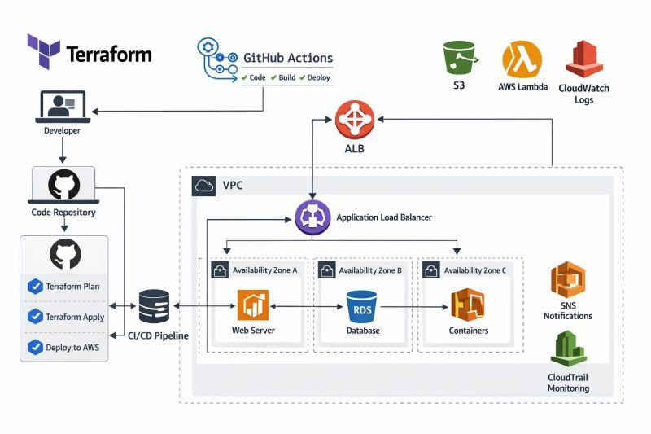
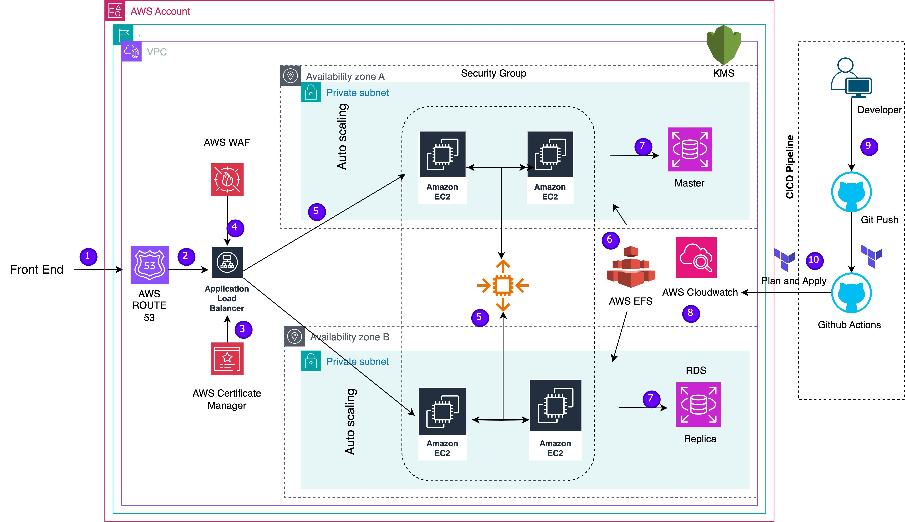
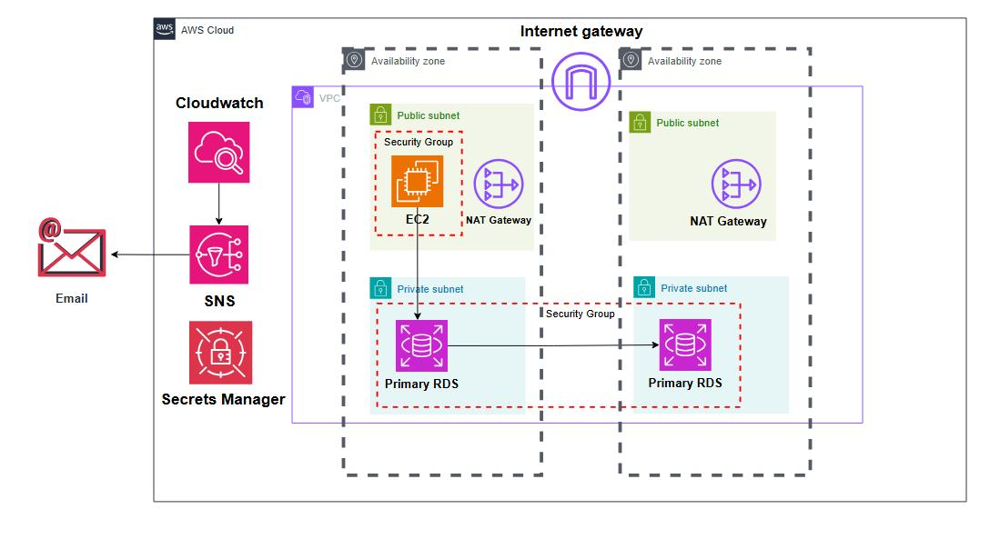

# Multi-Environment AWS Infrastructure with Terraform Modules

A production-style Infrastructure as Code (IaC) project that provisions and manages **Development, Staging, and Production** environments on AWS using **Terraform modules** and **GitHub Actions**. The project follows a modular Terraform architecture and automates infrastructure deployment across multiple environments.

---

## Project Overview

This project provisions a complete AWS infrastructure using reusable Terraform modules. Each environment (Dev, Staging, and Prod) has its own configuration while sharing the same Terraform modules.

The infrastructure includes:

- Amazon VPC with public and private subnets.
- Internet Gateway and NAT Gateway.
- Application Load Balancer (ALB).
- EC2 Auto Scaling Group using Launch Templates.
- Amazon RDS (MySQL) in private subnets.
- Amazon S3 bucket with lifecycle policy.
- IAM roles and policies.
- CloudWatch Logs, Metric Filters, and Alarms.
- SNS email notifications.
- Remote Terraform state stored in Amazon S3.
- GitHub Actions CI/CD for Dev, Staging, and Production.

---

## AWS Architecture

```text
GitHub Repository
        │
        ▼
 GitHub Actions (CI/CD)
        │
        ▼
     Terraform
        │
        ▼
──────────────── AWS ────────────────

            Internet
                │
        Internet Gateway
                │
     Application Load Balancer
                │
      Auto Scaling Group (EC2)
                │
        Launch Template + Apache

Public Subnets             Private Subnets
      │                           │
      │                     Amazon RDS (MySQL)
      │
 NAT Gateway + Elastic IP

Amazon S3
   ├── Terraform Remote State
   └── Application Storage

CloudWatch
   ├── Log Group
   ├── Metric Filters
   └── CloudWatch Alarms
             │
             ▼
        SNS Email Alerts
```

---

## Technologies Used

| Category | Technology |
|----------|------------|
| Infrastructure as Code | Terraform 1.6.x |
| Cloud Platform | AWS |
| CI/CD | GitHub Actions |
| Version Control | Git & GitHub |
| Compute | Amazon EC2 |
| Networking | VPC, Subnets, IGW, NAT Gateway |
| Load Balancing | Application Load Balancer |
| Database | Amazon RDS (MySQL) |
| Storage | Amazon S3 |
| Monitoring | CloudWatch |
| Notifications | Amazon SNS |

---

## Project Structure

```text
Multi-environment-AWS-Infrastructure-with-Terraform-modules/

├── .github/
│   └── workflows/
│       ├── terraform-dev.yml
│       ├── terraform-staging.yml
│       └── terraform-prod.yml
│
├── environments/
│   ├── dev/
│   ├── staging/
│   └── prod/
│
├── modules/
│   ├── vpc/
│   ├── ec2/
│   ├── rds/
│   ├── s3/
│   ├── iam/
│   └── cloudwatch/
│
├── backend.tf
├── providers.tf
├── versions.tf
├── variables.tf
└── outputs.tf
```

### Folder Description

| Folder | Purpose |
|--------|---------|
| `modules/` | Reusable Terraform modules for AWS resources. |
| `environments/dev` | Development environment configuration. |
| `environments/staging` | Staging environment configuration. |
| `environments/prod` | Production environment configuration. |
| `.github/workflows` | GitHub Actions pipelines for each environment. |

---

## Terraform Modules

### VPC Module

Creates:

- VPC
- Public and Private Subnets
- Internet Gateway
- NAT Gateway
- Elastic IP
- Route Tables
- Security Groups

### EC2 Module

Creates:

- Launch Template
- Auto Scaling Group
- Application Load Balancer
- Target Group
- Listener
- EC2 Security Group

### RDS Module

Creates:

- MySQL RDS Instance
- DB Subnet Group
- RDS Security Group

### S3 Module

Creates:

- S3 Bucket
- Versioning
- Lifecycle Configuration

### IAM Module

Creates:

- IAM Role
- IAM Instance Profile
- CloudWatch and SSM permissions

### CloudWatch Module

Creates:

- Log Group
- Log Metric Filter
- CPU Alarm
- EC2 Status Check Alarm
- Application Error Alarm
- RDS CPU Alarm
- SNS Topic
- SNS Email Subscription

---

## Multi-Environment Configuration

| Environment | Purpose |
|-------------|---------|
| **Development** | Infrastructure used for development and testing. |
| **Staging** | Pre-production environment for validation. |
| **Production** | Production-ready infrastructure deployed from the main branch. |

Each environment uses:

- Separate Terraform state.
- Separate tfvars configuration.
- Separate GitHub Actions workflow.
- Separate CloudWatch alarms and SNS topic.

---

## GitHub Actions CI/CD Pipeline

Three independent GitHub Actions workflows automate Terraform deployments.

| Workflow | Branch | Environment |
|----------|--------|-------------|
| `terraform-dev.yml` | `dev` | Development |
| `terraform-staging.yml` | `staging` | Staging |
| `terraform-prod.yml` | `main` | Production |

### Pipeline Steps

1. Checkout repository.
2. Configure AWS credentials using GitHub Secrets.
3. Install Terraform.
4. Run `terraform init`.
5. Run `terraform fmt -check`.
6. Run `terraform validate`.
7. Run `terraform plan`.
8. Run `terraform apply` (Production only on push to `main`).

### GitHub Secrets Used

| Secret | Purpose |
|--------|---------|
| `AWS_ACCESS_KEY_ID` | AWS authentication |
| `AWS_SECRET_ACCESS_KEY` | AWS authentication |
| `DEV_DB_PASSWORD` | Dev RDS password |
| `STAGING_DB_PASSWORD` | Staging RDS password |
| `PROD_DB_PASSWORD` | Production RDS password |
| `DEV_ALERT_EMAIL` | SNS email |
| `STAGING_ALERT_EMAIL` | SNS email |
| `PROD_ALERT_EMAIL` | SNS email |

Sensitive values are stored in **GitHub Secrets**, while non-sensitive infrastructure configuration is stored in `*.tfvars`.

---

## Deployment Steps

### Initialize Terraform

```bash
terraform init
```

### Development

```bash
cd environments/dev

terraform plan -var-file=dev.tfvars
terraform apply -var-file=dev.tfvars
```

### Staging

```bash
cd environments/staging

terraform plan -var-file=staging.tfvars
terraform apply -var-file=staging.tfvars
```

### Production

```bash
cd environments/prod

terraform plan -var-file=prod.tfvars
terraform apply -var-file=prod.tfvars
```

---

## Terraform Outputs

Each environment exposes useful outputs after deployment.

| Output | Description |
|--------|-------------|
| `alb_dns_name` | Application Load Balancer DNS endpoint. |
| `rds_endpoint` | Amazon RDS MySQL endpoint. |
| `s3_bucket_id` | S3 bucket name created for the environment. |
| `vpc_id` | VPC ID for the deployed environment. |

---

## Monitoring and Alerts

CloudWatch monitors infrastructure health using:

- EC2 CPU Utilization Alarm.
- EC2 Status Check Alarm.
- Application Error Metric Filter.
- RDS CPU Utilization Alarm.

SNS sends email notifications whenever an alarm enters the **ALARM** state.

---

## Security Features

- Infrastructure deployed inside isolated VPC.
- Public and Private Subnets for network segregation.
- RDS deployed only in Private Subnets.
- Security Groups restrict inbound and outbound traffic.
- IAM roles follow least-privilege access.
- Sensitive values managed through GitHub Secrets.
- Terraform remote state stored securely in Amazon S3.

---

## Challenges Faced During the Project

| Challenge | Resolution |
|-----------|------------|
| SNS email subscription remained pending. | Confirmed subscription from email and verified SNS topic subscription. |
| GitHub Actions couldn't find environment `*.tfvars` files. | Stored sensitive values in GitHub Secrets and managed tfvars correctly. |
| Terraform state lock prevented execution. | Removed stale state lock after verifying no active Terraform operation. |
| Elastic IP quota exceeded during Production deployment. | Identified unused Elastic IPs and resolved the AWS quota limitation. |
| Production GitHub Actions workflow did not trigger. | Configured workflow trigger to match the Git branching strategy. |
| RDS password validation failed during Production deployment. | Updated GitHub Secret with an AWS-compatible password format. |

---

## Key Terraform Concepts Demonstrated

- Reusable Terraform Modules.
- Variables and Environment-specific `tfvars`.
- Outputs between modules.
- Remote Backend using Amazon S3.
- State Management.
- Resource Dependencies.
- Launch Templates and Auto Scaling.
- CloudWatch Monitoring and SNS Notifications.
- Multi-environment Infrastructure Automation.
- GitHub Actions integration with Terraform.

---

## Project Outcome

Successfully provisioned and automated **Development, Staging, and Production** AWS environments using Terraform modules and GitHub Actions.

The infrastructure deployment is fully automated and **idempotent**, meaning repeated Terraform executions result in:

```text
No changes. Your infrastructure matches the configuration.
Apply complete! Resources: 0 added, 0 changed, 0 destroyed.
```

This project demonstrates practical Infrastructure as Code implementation, AWS networking, compute, database provisioning, monitoring, remote state management, and CI/CD automation using Terraform.

## AWS Architecture



## GitHub Actions Pipeline



## AWS Resources Created


